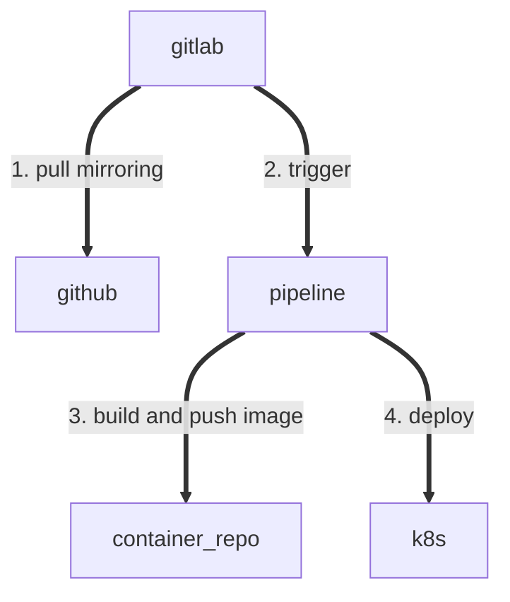

# eLwazi Catalogue

The catalogue is a React webapp using react admin

## Local Installation

Install the application dependencies by running:

```sh
npm install
```

## Development

Start the application in development mode by running:

```sh
npm run dev
```

## Production

Build the application in production mode by running:

```sh
npm run build
```

## Deployment
The app can be deployed as a docker image.

## CI/CD

We use gitlab for CI/CD.
The github repo is mirrored in gitlab.
The pipeline is defined in [.gitlab-ci.yml](.gitlab-ci.yml).
It deploys on the ait k8s.
It uses the following gitlab variables:
- project variables
  - KUBECTL_NAMESPACE - namespace specific for this catalogue project
- group variables
  - KUBECONFIG - secret file containing connection info to ait k8s cluster
  - KUBERNETES_MASTER - address of k8s cluster
  - DOCKER_CONFIG_JSON - secret file used for k8s to set up the image pull secret from the image repo on gitlab.



### CI/CD TO-DOs
1. trigger pipeline after push
2. use gitlab k8s integration
2. setup an gitlab environment
3. setup gitlab release tags
4. speed docker image build
5. use access tokens not tied to a personal account for gitlab access
